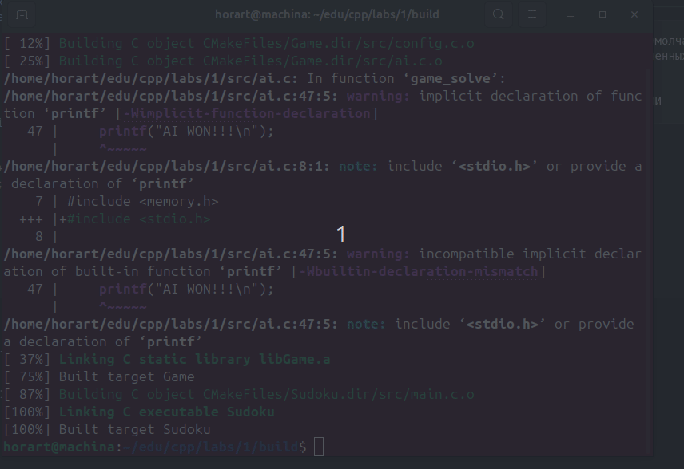
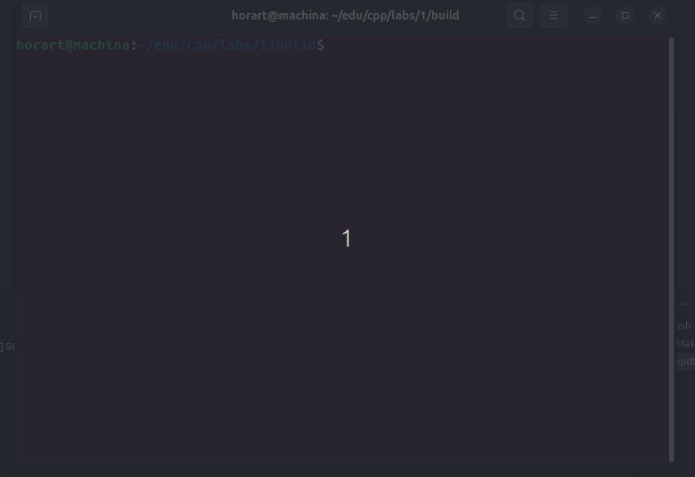

# Интерактивное судоку в терминале + подборщик решений (опробовано на Unix)

## Установка
```
cd build/
make
```

## Запуск
```
./Sudoku
```
Для передвижения по полю используйте стрелки, для заполнения полей - цифры сверху букв, для очищения поля - 0

## Параметры (src/config.c)
```
#define SUDOKU_FIELD_SIZE_DEFAULT 4 // размер поля по умолчанию
#define SUDOKU_PREFILLED_DEFAULT 1 // кол-во предзаполненных клеток по умолчанию
#define ENABLE_AI // включить ИИ
#define AI_DELAY_MS 50 // задержка после каждого хода ИИ
```

После изменений в src/config.c нужно пересобрать приложение

## Демо
* ### Работа в ручном режиме

* ### Авторежим


## Разработчикам

Код задокументирован в doxygen. При желании можно собрать документацию:
```
doxygen include/*
```